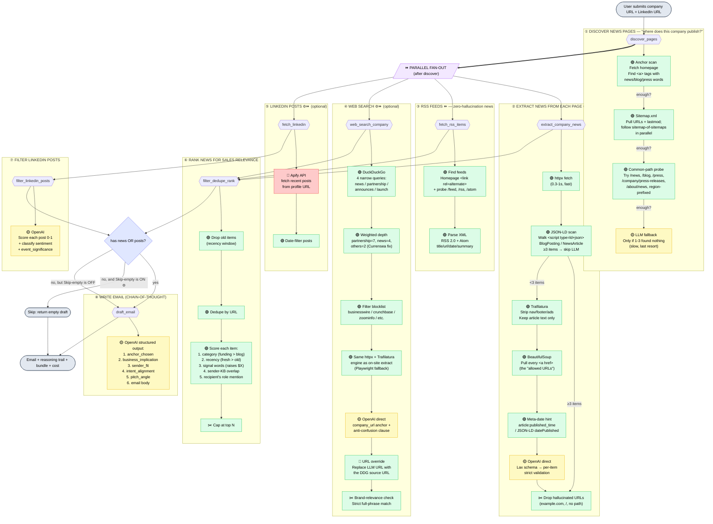

# 00 · How the system works — plain-English architecture

This doc explains what happens when a sales person types a company URL and clicks "Research" — from the click to the drafted email. Each stage is named, colour-coded, and explained in one sentence. Read top to bottom.

> **Note on recent changes.** The pipeline was originally a sequential chain of `SmartScraperGraph` calls. Today it's a much leaner setup: the heavy stages run in parallel, most pages get scraped with plain HTTP (Playwright only as a fallback), classifications and reasoning live in structured Pydantic outputs, and ScrapeGraphAI is only loaded on demand. This doc reflects the **current** architecture.

## The 60-second summary

You type in a company URL and (optionally) a LinkedIn profile. The system goes out to the web, finds recent news about the company, looks at the prospect's recent LinkedIn activity, classifies each item (sentiment + how substantive the event is), ranks everything, and writes a personalised cold email — with the LLM forced to lay out its business reasoning before it writes a single word of the email. Settings let you cap cost, narrow the recency window, or skip steps. The whole thing logs every step (including the LLM's reasoning trail) + cost so you can audit any run later.

## The big picture

```
        ┌─────────────────────────────────────────┐
        │   YOU (or your sales teammate)          │
        │   - Company URL                         │
        │   - LinkedIn URL (optional)             │
        │   - Recipient name + role               │
        │   - Sender profile (what you sell)      │
        │   - Intent ("ask for a 15-min call")    │
        └────────────────┬────────────────────────┘
                         │
                         ▼
        ┌─────────────────────────────────────────┐
        │   RESEARCH PIPELINE (this app)          │
        │   1. Find where the company posts news  │
        │   2-5. ALL IN PARALLEL after step 1:    │
        │      • Pull on-site news                │
        │      • Cross-check with RSS feeds       │
        │      • Web-search third-party coverage  │
        │      • Pull LinkedIn posts              │
        │   6. Rank for sales relevance           │
        │   7. Filter LinkedIn posts (LLM)        │
        │   8. Write the email (chain-of-thought) │
        └────────────────┬────────────────────────┘
                         │
                         ▼
        ┌─────────────────────────────────────────┐
        │   OUTPUT                                │
        │   - Email draft (copy/paste ready)      │
        │   - LLM reasoning trail (auditable)     │
        │   - News items + classifications        │
        │   - LinkedIn posts + classifications    │
        │   - $ cost report + full step log       │
        └─────────────────────────────────────────┘
```

## The detailed flowchart

Each box is a real function. Colours:

- 🟢 **Free** — just HTTP requests, no AI, no money spent
- 🟡 **Cheap LLM** — small AI calls, fractions of a cent
- 🔴 **External API** — costs money per call (Apify)
- ⚙️ **Optional / toggleable** — can be turned off in Advanced settings
- ⏩ **Parallel** — runs concurrently with sibling steps



## The big architectural shifts (worth knowing for the presentation)

| Shift | Before | After (today) |
|---|---|---|
| **Stage parallelism** | Sequential: discover → extract → rss → search → linkedin → … | Parallel: discover, then `{extract, rss, search, linkedin}` all run concurrently → ~30-50% wall-clock saving |
| **Web search engine** | `SmartScraperGraph` per URL (Playwright every time, ~6-8s each) | `httpx → Trafilatura → OpenAI` (same engine as on-site extract). Playwright only as fallback when httpx fails or page is a SPA shell. ~3-5× faster, 5-6× cheaper |
| **LLM output schema** | Strict `NewsItemList` — one bad URL killed the whole response | Lax `_LaxNewsItemList` at LLM parse time; strict per-item validation downstream (drops the bad row only) |
| **URL hallucination** | LLM sometimes emitted `example.com` / `https://in/...` / homepage as the article URL | (1) Schema rejects placeholder hosts + dotless hosts; (2) web search overrides LLM URL with the DDG-supplied source URL; (3) `_extract_links` filters root-only URLs out of the offered set |
| **Date hallucination** | LLM defaulted to the recency cutoff date when it couldn't determine the real one — every item stamped the same | Trafilatura's `extract_metadata().date` is passed to the LLM as a hint; prompt explicitly says "SKIP if you can't determine the real date, do NOT default to the cutoff" |
| **Brand disambiguation** | "Hedge funds turn bullish on US equities" matched "Hedge Equities" via per-token expansion | Strict full-phrase brand match + LLM prompt explicitly warns "do NOT include generic industry topics that share words" |
| **Classifications** | Items had only `category` (news/funding/launch/...) | Items now also carry `sentiment` (positive/neutral/negative) and `event_significance` (major/notable/routine/administrative/peripheral/negative). LinkedIn posts too |
| **Email writer** | "Stitch news + posts into 80-120 words" — produced surface-level "you use AI in education, we use AI in films" parallels | Forced chain-of-thought: anchor → business_implication → sender_fit → intent_alignment → pitch_angle → email. Reasoning is logged with every draft so you can audit *why* an email reads the way it does |

## What controls what happens — knobs you can turn

These live in **Advanced settings** on the UI (and as `.env` defaults).

| Knob | What it does | Default |
|---|---|---|
| **Recency window** | Drop news older than this many days. Chips: 30/60/90/180. | 90 days |
| **Max news items** | Hard cap on how many news items reach the email writer. | 8 |
| **Max discovered URLs** | How many pages discovery is allowed to return. | 8 |
| **Search max results** | Scaling factor for web search (each prospect ends up scraping `n*3 = 15` URLs across the 4 intent queries). | 5 |
| **Enable external web search** | Turn off step ④. | off |
| **Enable LinkedIn fetch** | Turn off step ⑤. | on |
| **Skip email when no context** | Don't draft an email if news + LinkedIn both empty. | off |
| **Cost cap** | Pipeline aborts if estimated $ goes above this. | $0.20 |

## What gets logged

Every run writes a JSON log to `logs/<timestamp>_<id>.json`. The structure mirrors the diagram above:

- `inputs` — everything you typed
- `steps[*]` — for each pipeline step: `name`, `started_at`, `duration_seconds`, `status`, `input`, `output`, `estimated_cost_usd_delta`. Parallel steps will have overlapping start times.
- `steps[draft_email].output` — the FULL `DraftedEmail` Pydantic object including the LLM's reasoning trail (anchor_chosen, business_implication, sender_fit, intent_alignment, pitch_angle, email). This is the auditability win: you can see exactly *why* the LLM picked the angle it did.
- `result.items_preview` — final news items kept, with `category`, `sentiment`, `event_significance`, `published_date`.
- `totals.estimated_cost_usd` / `actual_cost_usd` — running tab.

Open one to debug "why didn't this find news?", "why did it pick that item?", or "why is the email opening with that point?".

## What the system does NOT do

- **Doesn't send the email.** You copy/paste it.
- **Doesn't store the prospect.** Stateless per run, only the log is kept.
- **Doesn't guess at facts.** If RESEARCH is empty, the email opens with a generic prospect-anchored intro and the writer's prompt explicitly tells it not to fabricate quotes, news, or posts.
- **Doesn't beat Cloudflare on its own.** If a company aggressively bot-walls their site (Thredd is a fixture example), on-site extraction may return zero — that's why web search and RSS exist as parallel sources, and why the test fixture keeps `cloudflare-walled` as a known-FAIL scenario.
- **Doesn't rank LinkedIn posts and news together.** They're separate signals; the email writer's chain-of-thought picks one as the `anchor_chosen` regardless of source.
- **Doesn't weight sentiment / event_significance into ranking yet.** Those classifications are populated but currently informational only (Phase 1). Phase 2 will weight them once we've manually verified the LLM's classifications are reliable.

## Where to look in the code

| Box in the diagram | File |
|---|---|
| ① Discover pages | [`src/company.py`](../src/company.py) → `discover_pages` |
| ② Extract news | [`src/extractor.py`](../src/extractor.py) → `extract_news_from_pages` (httpx + Trafilatura + JSON-LD short-circuit + direct OpenAI) |
| ③ RSS feeds | [`src/rss.py`](../src/rss.py) → `fetch_rss_items` |
| ④ Web search | [`src/search.py`](../src/search.py) → `web_search_company` (multi-intent DDG + same engine as ②) |
| ⑤ LinkedIn fetch | [`src/linkedin.py`](../src/linkedin.py) → `fetch_linkedin` (Apify) |
| ⑥ Rank news | [`src/relevance.py`](../src/relevance.py) → `rank_news` + `score_relevance` |
| ⑦ Filter LinkedIn posts | [`src/linkedin_filter.py`](../src/linkedin_filter.py) → `filter_linkedin_posts` |
| ⑧ Email writer | [`src/email_writer.py`](../src/email_writer.py) → `draft_email` (chain-of-thought, `DraftedEmail` schema) |
| Parallel orchestration | [`src/pipeline.py`](../src/pipeline.py) → `research_pipeline` (`ThreadPoolExecutor` fan-out) |
| Item / post schemas | [`src/schemas.py`](../src/schemas.py) → `NewsItem`, `LinkedInPost`, `NewsSentiment`, `EventSignificance` |
| Settings (UI ↔ DB) | [`src/settings.py`](../src/settings.py), [`src/db.py`](../src/db.py) |
| Cost meter (thread-safe) | [`src/cost_guard.py`](../src/cost_guard.py) → `CostMeter` |
| Per-run logging | [`src/query_log.py`](../src/query_log.py) → `QueryLogger` |
| Web UI | [`templates/index.html`](../templates/index.html) |
| HTTP server | [`app.py`](../app.py) |
